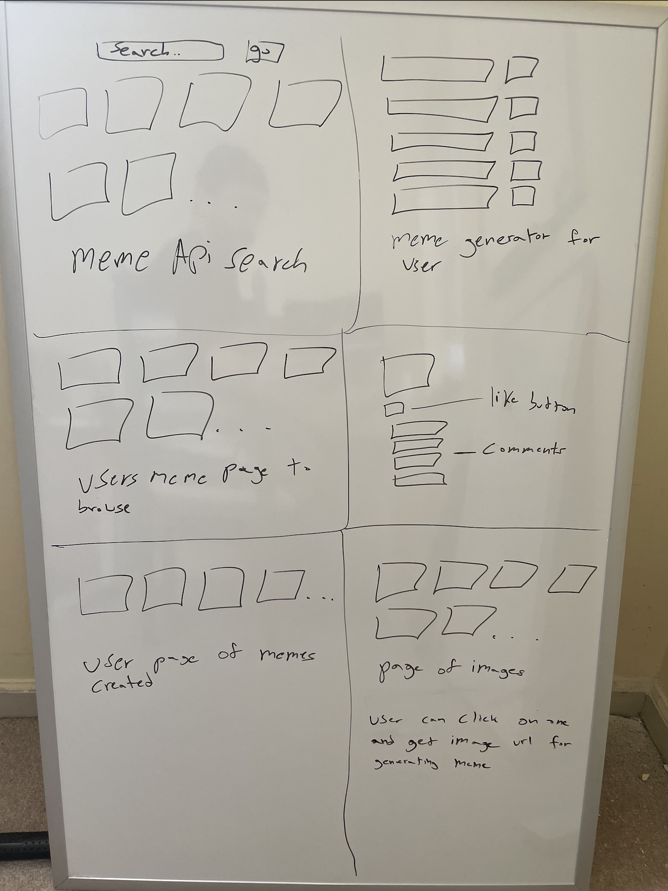
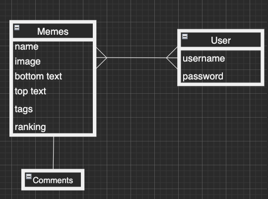

## Project 2 - Meme-Generator - 
---
##### My second project is a full stack application created mostly with Mongoose, Express, Liquid, and Javacsript, An API was originally consumed but it crashed and I had to seed data as a result
---
### Description
---
##### Welcome! Meme-Generator is a fun app for creating memes! Have you ever generated memes on a site and found it unfortunate that they're uneditable or can't be saved? Meme-Generator is a great way to do that! I hope you enjoy the opportunity to make memes and have a collection of what you've done as well as view and comment the work of others!
---
### Installation:
---
##### 1. Fork and clone the repository
##### 2. Navigage into the directory
##### 3. Run npm install or npm i to install dependencies
##### 4. Touch .gitignore and run echo node_modules > .gitignore
##### 5. Touch .env and run the same echo command for the .env file
##### 6. The url is the following: 'https://localhost:3000'
---
### User Experience
---
##### The order below is an example of how to make use of the app:

##### 1.Sign up for an account and sign in
##### 2. View all memes that have been seeded for some inspiration. Try commenting as well!
##### 3. Try creating a meme by clicking on Create Meme and entering a value for the top text and bottom text as well as a link for the image. 
##### 4. Once created, you're redirected to your created memes page. This page can be accessed by clicking on My Memes or Hello (user)
##### 5. Click Log Out to log out and sign up/sign in again.
##### 6. Enjoy!
---
<table>
  <tr>
    <th>Verb</th>
    <th>Path</th>
    <th>Action</th>
    <th>Description</th>
    <th>Model</th>
  </tr>
  <tr>
    <td>GET</td>
    <td>/memes</td>
    <td>Index</td>
    <td>Index of all memes</td>
    <td>Meme</td>
  </tr>
  <tr>
    <td>GET</td>
    <td>/memes/mine</td>
    <td>Index</td>
    <td>Index of user memes</td>
    <td>Meme</td>
  </tr>
  <tr>
    <td>GET</td>
    <td>/memes/mine/:id</td>
    <td>Show</td>
    <td>Show of one specific user meme</td>
    <td>Meme</td>
  </tr>
  <tr>
    <td>GET</td>
    <td>/memes/mine/:id/edit</td>
    <td>Edit</td>
    <td>Edit route for one meme's image, top and bottom text</td>
    <td>Meme</td>
  </tr>
  <tr>
    <td>GET</td>
    <td>/memes/new</td>
    <td>Create</td>
    <td>Create one meme's image, top and bottom text</td>
    <td>Meme</td>
  </tr>
  <tr>
    <td>PUT</td>
    <td>/memes/mine/:id<td>
    <td>Edit</td>
    <td>Edit put route for one meme's image, top and bottom text</td>
    <td>Meme</td>
  </tr>
  <tr>
    <td>POST</td>
    <td>/memes</td>
    <td>Create</td>
    <td>Create post route for one meme's image, top and bottom text</td>
    <td>Meme</td>
  </tr>
  <tr>
    <td>DELETE</td>
    <td>/memes/mine/:id/delete</td>
    <td>Delete</td>
    <td>Delete route for one meme</td>
    <td>Meme</td>
  </tr>
</table>

---
| Verb | Path |
| --- | ----------|

---
### WireFrames:

---
### ERD:

