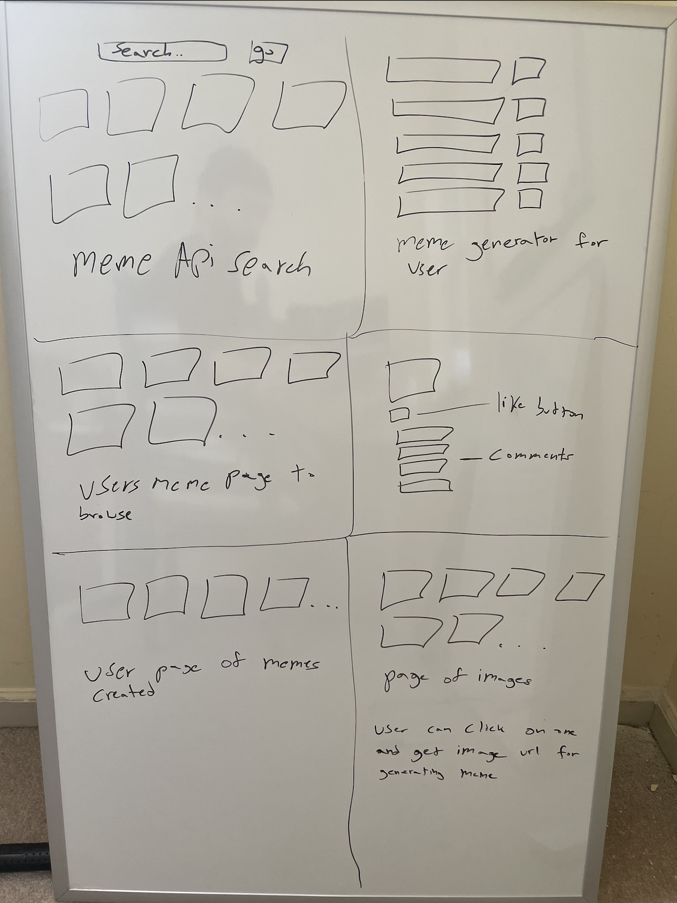
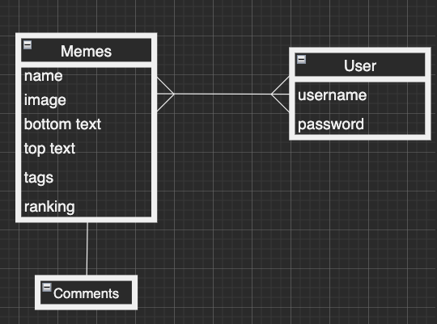

## Project 2 - Meme-Generator - A low stakes opportunity to be funny or a complete twat

---

### Concept: 
    
##### The user experience will involve navigating an app that allows you to search for APIs for inspiration, create your own, browse those made and like and comment

---
###### Navigation without an account:
- ###### Without an account, the user will be able to search for memes via a meme API, view memes that have been created on the app and their comments and ranking. A non-authenticated user will have a chance to like but will need an account to leave comments.

###### Navigation with an account
- ###### With an account, the authenticated user will also be able to create memes via a model that reflects similar schema properties as the meme API, for consistency. Those memes will be saved to their account and will be accessible to others for commenting or ranking(via likes). 

- ###### The authenticated user will be able to like and comment. 

- ###### The authenticated user will be able to access a page for creating memes

- ###### The authenticated user will be able to acess a page full of photos that they can use to create a meme. The show page of each photo will have a url link that can be used to the create meme page.

---
###### Stretch goals:
- ###### The ranking system that can organize memes by the amount of likes
- ###### a url copy clipboard to make the user's life easier when creating a meme
---

###### tools:

- ###### HTML
- ###### CSS
- ###### Javascript
- ###### API (https://mememaker.github.io/API/)
- ###### Express
- ###### MongoDb

